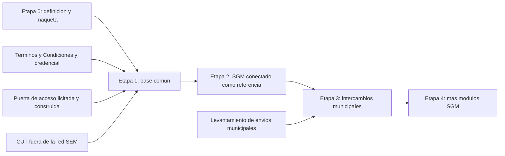

# Nodo SUBDERE — documento rector y hoja de ruta

**Estado:** borrador de trabajo, 30 de septiembre de 2026. Nada de lo que dice está comprometido institucionalmente.

Este documento responde, en un solo lugar, **qué es el Nodo SUBDERE, para quién es, qué hace, cómo se gobierna y hacia dónde va**. Es la fuente de la que se alimentan el sitio y lo que se construya después: si una página del sitio contradice este documento, se corrige la página, o se corrige primero este documento y después la página.

## Cómo se lee

- **No inventa nada.** Cada sección cita de dónde sale lo que afirma, con una ruta del repositorio. Lo que el corpus no dice queda como pendiente.
- **Cada sección declara su estado:**
  - **Definido**: lo decidió la jefatura o está vigente en el sitio.
  - **Propuesta**: está escrito en un documento del repositorio, pero no se ha adoptado.
  - **Pendiente**: el corpus no lo resuelve.
- **Cada sección dice qué página del sitio la usa.** Cuando esa página no existe, lo dice.
- **La «respuesta corta»** de cada sección está escrita con el tono de la wiki (ver [`maqueta.md`](maqueta.md), «El tono de la wiki»), para que el sitio la pueda tomar casi tal cual.
- **No duplica.** Lo que ya tiene documento propio se resume y se enlaza: la decisión del estándar legible por máquina ([`adr-2026-09-estandar-legible-por-maquina.md`](adr-2026-09-estandar-legible-por-maquina.md)), la puerta de acceso ([`plataforma-control.md`](plataforma-control.md)), el precedente del Nodo Laboral y Previsional ([`nodo-lp-precedente.md`](nodo-lp-precedente.md)), el modelo del catálogo ([`maqueta.md`](maqueta.md)) y el glosario ([`wiki-glosario.html`](../prototipos/wiki-glosario.html)).
- **Pendientes.** Los marcadores `X-nn` son los que ya usan los documentos de este repositorio. Los vacíos que no tenían marcador llevan uno local, `HR-nn`, y están todos en la [Parte III](#parte-iii--preguntas-abiertas).
- **Sin fechas inventadas.** Las únicas fechas son las que ya están en el corpus. La hoja de ruta ordena etapas por dependencia, no por plazo.

---

# Parte I — Documento rector

## 1. Qué es el Nodo SUBDERE

**Estado:** Definido.

**Respuesta corta.** El Nodo SUBDERE es la plataforma de encuentro municipal: el punto donde se cruzan los intercambios de información entre los municipios y las instituciones que se la piden. Publicamos de antemano qué se entrega o se pide en cada intercambio y en qué forma, y lo ofrecemos por una sola puerta. Así el municipio prepara cada informe una vez, sabe antes de enviarlo si está bien y guarda un comprobante con la misma forma para todos.

**Detalle.**
- Nombre en el sitio: «Nodo SUBDERE, la plataforma de encuentro municipal». Se eligió porque «Nodo SUBDERE» a secas se leía como una red aparte.
- El sitio tiene tres piezas: el **catálogo de APIs** (para construir), el **catálogo de servicios** (para resolver una tarea sin programar) y la **wiki** (para entender).
- El problema que resuelve: hoy cada institución define su propio formato, su propia página y su propia clave, y cada comprobante queda en una plataforma distinta.
- «Nodo» tiene dos sentidos: el Nodo SUBDERE como punto de cruce, y cada intercambio del catálogo, que también se llama «un nodo».

**Fuentes.** `prototipos/index.html` (hero, «Qué propone»), `prototipos/que-es.html`, `prototipos/wiki-glosario.html#nodo`, [`maqueta.md`](maqueta.md) («Qué describe el sitio, y qué no»).

**Lo usa:** `index.html`, `que-es.html`.

## 2. Para quién es

**Estado:** Definido.

**Respuesta corta.** El nodo sirve a los **municipios**, que entregan y consultan información; a los **proveedores** y equipos de informática que construyen sus sistemas; y a las **instituciones que reciben información** de los municipios. SUBDERE lo opera, y su propio sistema, el SGM, entra por la misma puerta que cualquier otro.

**Detalle.**

| Público | Qué obtiene | Estado |
|---|---|---|
| Municipios | Conectarse sin cambiar de sistema; revisar antes de enviar; un comprobante común; una credencial del municipio | Definido como propuesta de valor. La credencial está por definir |
| Proveedores e informática municipal | Contratos públicos para construir sin pedir permiso; ambiente para practicar | Contratos publicados para dos intercambios. La zona de práctica está por construir |
| Instituciones que reciben información | Recibir de un solo punto, en el formato que ya aceptan | **Pendiente**: no está levantado qué envían los municipios a cada institución ni por qué canal (HR-06) |
| SGM (sistema de SUBDERE) | Es el primer sistema conectado y la referencia con la que se prueba cada estándar | Definido. Sin atajos |

La escala de referencia son 345 municipios y decenas de proveedores (`docs/nodo-lp-precedente.md`).

**Fuentes.** `prototipos/participar.html`, `prototipos/wiki.html`, `prototipos/que-es.html` (casos), `prototipos/wiki-glosario.html#sgm`.

**Lo usa:** `participar.html`, `wiki.html`.

## 3. Qué hace

**Estado:** Definido como diseño. Parte de las capacidades todavía no existe (ver la columna de estado).

**Respuesta corta.** En cada intercambio el municipio **entrega** información o **pregunta** por ella. Para entregar, el nodo le permite revisar el informe contra las reglas publicadas antes de que salga, lo autoriza el funcionario responsable y queda un comprobante. Para preguntar, basta con pedir, y queda registro de quién preguntó qué. Todo pasa por una sola puerta de acceso.

**Detalle.**

| Capacidad | Qué es | Estado |
|---|---|---|
| Publicar estándares | Descripción de cada intercambio legible por personas y por programas, con versión; ninguna versión se corrige | Definido. Dos contratos publicados |
| Informar la versión desde la API | Cada API publicada informa, dentro de su contrato, su versión, su fecha de publicación y el plazo de gracia vigente | Definido en el sitio el 30 de septiembre de 2026. Duración del plazo pendiente (X-109) |
| Revisar | Gratis y repetible, sin que nada salga del municipio. Con nuestras reglas y con las reglas de la norma | Definido como diseño. No construido |
| Autorizar | El funcionario responsable autoriza el envío | Definido como diseño |
| Comprobante | Qué se envió, cuándo, a quién y con qué versión de las reglas. Lo emite el servicio que recibe | Definido como diseño |
| Consultar | Pedir un dato; queda registro de quién preguntó | Definido. El CUT responde consultas en la red SEM |
| Puerta de acceso | Punto único de entrada: identidad, permiso temporal, cuotas y registro | Propuesta. Diseñada, no construida |
| Practicar y operar | Practicar con datos inventados sin permiso; operar con credencial | Zona de práctica por construir. Ambientes de prueba dentro del navegador para el CUT y los permisos de circulación |
| Catálogos y wiki | APIs, servicios (aplicaciones) y wiki | Primera versión publicada |

**Fuentes.** `prototipos/que-es.html`, `prototipos/wiki-recorrido.html`, `prototipos/wiki-conectar.html#versiones`, `prototipos/wiki-consumir.html`, [`plataforma-control.md`](plataforma-control.md), [`adr-2026-09-estandar-legible-por-maquina.md`](adr-2026-09-estandar-legible-por-maquina.md).

**Lo usa:** `que-es.html`, `wiki-recorrido.html`, `wiki-consumir.html`, `wiki-conectar.html`.

## 4. Alcance, y lo que el nodo no es

**Estado:** Definido.

**Respuesta corta.** El nodo describe y resuelve el lado municipal: lo que el municipio obtiene al entregar o consultar información. No es una red paralela del Estado, no guarda copias de los datos y no reemplaza a los sistemas que los producen.

**Detalle.**
- **El sitio describe el lado municipal y no declara una topología de transporte.** Decisión de la reunión del 23 de septiembre de 2026 ([`maqueta.md`](maqueta.md)).
- El tráfico entre organismos del Estado corresponde a la Red de Interoperabilidad y a PISEE, según la Norma Técnica de Interoperabilidad ([`plataforma-control.md`](plataforma-control.md), §7).
- El sitio del nodo no autentica ni controla el paso: eso lo hace la puerta de acceso (`backend/README.md`).
- No es un registro paralelo ni guarda copias de datos (`backend/README.md`).
- La puerta de acceso no define el negocio de ningún intercambio; solo publica, autoriza y deja constancia ([`plataforma-control.md`](plataforma-control.md)).
- SUBDERE no es autora del contrato de un servicio que no opera: lo publica tal como lo entregó su responsable (ADR).
- Quedan fuera un motor de integración hacia sistemas sin API y publicar la propia puerta como ficha del catálogo ([`plataforma-control.md`](plataforma-control.md), §7).

**Lo usa:** `que-es.html` (parcialmente). No hay una sección «qué no es» en el sitio.

## 5. Principios

**Estado:** Definido.

| Principio | Qué significa | Fuente |
|---|---|---|
| Nadie tiene atajos | Toda pantalla, incluida la de SUBDERE y el SGM, usa la misma interfaz pública que un municipio o un proveedor | `README.md`, `CONTRIBUTING.md`, `que-es.html` |
| La crítica va en la wiki, no en el catálogo | El catálogo publica cada contrato tal como se entregó; las observaciones van en su entrada de wiki | `README.md` |
| Estándar legible por máquina | El contrato se publica como especificación; el catálogo la renderiza y no la transcribe | ADR |
| Solo una vez | El municipio no entrega lo mismo muchas veces (Ley 21.180) | [`nodo-lp-precedente.md`](nodo-lp-precedente.md) |
| Entrada completa antes que lista larga | Un intercambio aparece cuando tiene contrato, pantalla y entrada de wiki | Decisión de la jefatura del 26 de septiembre de 2026 ([`maqueta.md`](maqueta.md)) |
| Lo publicado funciona | Un contrato se publica solo con el servicio disponible | Criterio del equipo, 30 de septiembre de 2026 |

**Lo usa:** repartido en `index.html`, `que-es.html` y la wiki. No hay una página de principios.

## 6. Historia y precedentes

**Estado:** Definido (hechos fechados del corpus). La historia institucional formal (resolución, mandato, presupuesto) es **Pendiente** (HR-15).

| Fecha | Hecho | Fuente |
|---|---|---|
| 26 de noviembre de 2025 | Entra en operación el Nodo Laboral y Previsional de la Subsecretaría de Previsión Social, el precedente más cercano | [`nodo-lp-precedente.md`](nodo-lp-precedente.md) |
| 8 de septiembre de 2026 | María José Besa hace el mapeo de interoperabilidad del Juzgado de Policía Local, tras la reunión con el JPL de Lo Barnechea; Allison Díaz agrega tres nodos | `prototipos/assets/data.js` |
| 15 de septiembre de 2026 | Se escriben el ADR del estándar legible por máquina, la nota de la Plataforma de Control y el análisis del Nodo L&P. Entran la base común del SGM y Adquisiciones. Se registra el contrato del CUT entregado por Juan Helo | `data.js`, [`maqueta.md`](maqueta.md) |
| 16 de septiembre de 2026 | Se retira «Estándares de Gobierno Digital» del catálogo: es condición de capa, no intercambio | [`maqueta.md`](maqueta.md) |
| 23 de septiembre de 2026 | La jefatura de la División define la arquitectura: conexión con el Estado por los nodos de la Red de Interoperabilidad o los convenios vigentes, y exposición a los municipios con capa de identidad y de control de paso | [`maqueta.md`](maqueta.md) |
| 26 de septiembre de 2026 | La jefatura decide dejar visibles solo los intercambios completos: CUT y permisos de circulación | [`maqueta.md`](maqueta.md) |
| 27 de septiembre de 2026 | Entran los permisos de circulación como demostración, para conversarlo con la Secretaría de Gobierno Digital | [`maqueta.md`](maqueta.md) |
| 29 de septiembre de 2026 | El sitio se escribe como versión definitiva; la wiki se ordena como WikiGuías | [`maqueta.md`](maqueta.md) |
| 30 de septiembre de 2026 | Premisa «lo publicado funciona»; primera versión de este documento | este documento |

**Lo usa:** ninguna página. No existe una página de historia (ver [Parte IV](#parte-iv--mapa-hacia-el-sitio)).

## 7. Gobernanza

**Estado:** Parcial. Quién decide hoy está definido; la gobernanza permanente del nodo es **Propuesta** o **Pendiente**.

**Respuesta corta.** El nodo lo impulsa la División de Políticas y Estudios de SUBDERE. Cada contrato tiene un responsable que responde por él, y SUBDERE lo publica sin editarlo. La puerta de acceso se contrata aparte del SGM.

**Detalle.**
- **Quién decide hoy:** la jefatura de la División de Políticas y Estudios (decisiones del 23 y 26 de septiembre de 2026).
- **Contacto del proyecto:** Jaime Hernández, jaime.hernandez@subdere.gov.cl (`README.md`). Es el contacto del repositorio y de la maqueta, no una mesa de ayuda (HR-01).
- **Mantenedor del catálogo:** SUBDERE edita las fichas desde un mantenedor, sin tocar código. No edita contratos, herramientas, disponibilidad ni datos de prueba ([`plantillas.md`](plantillas.md)).
- **Responsables de contrato** (`espec.procedencia.responsable` en `data.js`):
  - CUT: SUBDERE, equipo SEM.
  - Base común del SGM y Adquisiciones: SUBDERE, equipo SGM.
  - Permisos de circulación: el equipo del Nodo SUBDERE, mientras Servicios Municipales no publique el contrato.
- **SUBDERE frente a contratos de terceros:** puede rechazar un registro, pero no modificarlo (ADR, §3.3).
- **Puerta de acceso:** se licita aparte del SGM; el SGM es su primer consumidor, no su dueño. Construir y operar conviene licitarlos por separado (X-84) ([`plataforma-control.md`](plataforma-control.md), §5).
- **Gobernanza permanente (Propuesta):** del Nodo L&P se propone copiar el modelo de cuatro columnas (plataforma, convenio de adhesión, reglamentos, herramientas), una gobernanza en cinco niveles con operador técnico externo, una mesa técnica permanente y un repositorio de tickets publicados. Su incorporación a una decisión del nodo está pendiente (HR-16) ([`nodo-lp-precedente.md`](nodo-lp-precedente.md)).
- **Organigrama y roles formales:** no existen (HR-04).
- **Gobierno del repositorio:** GitHub es el origen, GitLab SUBDERE un espejo; todo cambio entra por Pull Request revisado ([`CONTRIBUTING.md`](../CONTRIBUTING.md)).

**Lo usa:** ninguna página. No existe una página de gobernanza ni de organigrama.

## 8. Marco normativo

**Estado:** Parcial. Las normas generales están citadas; el tramo municipal es **Pendiente** (HR-10).

**Respuesta corta.** El nodo se apoya en la Ley de Transformación Digital del Estado y en la Norma Técnica de Interoperabilidad. Qué obliga específicamente a cada municipio, y desde cuándo, todavía está por escribir.

| Norma, tal como la cita el corpus | Para qué se cita | Fuente |
|---|---|---|
| Ley N° 21.180, Transformación Digital del Estado | Principio «solo una vez»; texto leído | `prototipos/wiki-normas.html`, [`nodo-lp-precedente.md`](nodo-lp-precedente.md) |
| DFL N° 1, de 2020 | Gradualidad; la interoperabilidad es la fase 6 | `wiki-normas.html` |
| Decreto N° 12, de 2023 (Norma Técnica de Interoperabilidad) | Red, nodos, catálogos y trazabilidad | `wiki-normas.html`, [`plataforma-control.md`](plataforma-control.md) |
| Ley N° 19.880, artículo 19 | Procedimiento administrativo electrónico | `wiki-normas.html` |
| Ley 19.886 | Compras públicas: licitar por propiedades, no por marcas | [`plataforma-control.md`](plataforma-control.md) |
| Decreto Supremo N° 1.439, de 2000, y Decreto Exento N° 1.115, de 2018 | Códigos Únicos Territoriales (solo se leyó la referencia) | `prototipos/wiki-cut.html` |

**Lo usa:** `wiki-normas.html`.

## 9. Arquitectura y estado de los componentes

**Estado:** mixto (ver la tabla).

| Componente | Qué es | Estado | Fuente |
|---|---|---|---|
| Puerta de acceso (Plataforma de Control) | Entrada única, identidad (OAuth 2.0 / OIDC), permiso temporal, cuotas, registro sin secretos. Dos planos: personas con Clave Única y sistemas con credencial (X-02) | Propuesta, diseñada y no construida. Nombre provisional (HR-11) | [`plataforma-control.md`](plataforma-control.md), [`flujo_1.md`](flujo_1.md), [`flujo_2.md`](flujo_2.md) |
| Sitio: maqueta | HTML sin dependencias, publicado en GitHub Pages | En uso, primera versión | `prototipos/`, [`maqueta.md`](maqueta.md) |
| Sitio: backend | Django, DRF, PostgreSQL: catálogo, servicios, wiki, integraciones | Estructura inicial, sin código | `backend/README.md` |
| Sitio: frontend | React, TypeScript, Vite | Estructura inicial, sin código | `frontend/README.md` |
| Estándar y versionado | Especificación versionada aparte de la ficha, sin correcciones | Definido. Política de versión mayor, aviso y plazo de gracia pendientes (X-109) | ADR, `wiki-conectar.html` |
| Monitoreo de disponibilidad | Monitor externo que publica `estado/status.json` | Pendiente: no hay monitor elegido (HR-09) | [`maqueta.md`](maqueta.md) |
| Zona de práctica | Un espacio con datos inventados por servicio | Por construir; abierta o con registro, sin decidir (HR-08) | `participar.html`, `wiki-glosario.html` |
| Ambientes de prueba de las fichas | Consola dentro del navegador que ejecuta el contrato contra datos de prueba | Construido para el CUT y los permisos de circulación | `prototipos/assets/sandbox.js` |

**Lo usa:** `que-es.html` («Por dónde pasa todo»), `wiki-recorrido.html`, `wiki-decisiones.html`.

## 10. Catálogo actual

**Estado:** Definido.

**Respuesta corta.** El catálogo parte corto a propósito. Hoy tiene dos intercambios completos, con contrato, aplicación y entrada de wiki: los Códigos Únicos Territoriales y los permisos de circulación por patente.

| Intercambio | En el catálogo | Contrato | Estado real del servicio |
|---|---|---|---|
| Códigos Únicos Territoriales (`cut`) | Visible | OpenAPI, copia exacta | Responde solo en la red SEM, sin compromiso de disponibilidad |
| Permisos de circulación (`fiscalizacion`) | Visible | OpenAPI, propuesta reconstruida | Sin servicio detrás: demostración con datos inventados |
| Base común del SGM (`sgm-core`) | Oculto | Solo metadato | No corre |
| Adquisiciones (`adquisiciones`) | Oculto | Instantánea OpenAPI 0.1.0 | No corre |

- **Aplicaciones:** buscador de códigos territoriales y consulta de permiso de circulación.
- **Criterio para entrar:** contrato publicado, pantalla que lo usa y entrada de wiki (26 de septiembre de 2026). Desde el 30 de septiembre de 2026, además, **servicio disponible**.
- **Premisa del sitio y estado real.** El sitio se escribe asumiendo que lo publicado funciona. Hoy eso no es así para ninguno de los dos intercambios visibles: la distancia entre ambos es trabajo de la Etapa 1.
- **Los nueve intercambios del mapeo del JPL** salieron del catálogo, pero no del levantamiento; vuelven cuando tengan contrato ([`maqueta.md`](maqueta.md)).

**Lo usa:** `apis.html`, `catalogo.html`, `wiki-intercambios.html`.

## 11. Cómo participar

**Estado:** Parcial. El camino está definido; sus piezas legales y técnicas están **Pendientes**.

**Respuesta corta.** Construir y practicar no le pide permiso a nadie: todo lo publicado es público. Para trabajar con datos reales de un municipio, el municipio acepta los Términos y Condiciones con SUBDERE y recibe una credencial a su nombre.

| Perfil | Camino | Qué falta |
|---|---|---|
| Municipio | Conectar su sistema actual; aceptar los Términos y Condiciones; recibir la credencial | Términos y Condiciones sin redactar (HR-07); puerta sin construir |
| Proveedor | Construir contra los contratos publicados; practicar; operar con la credencial del municipio que lo autoriza | Zona de práctica; título jurídico de acceso de privados, acreditación y tarifa (X-87 y X-88 según `plataforma-control.md`; ver HR-17) |
| Institución que recibe información | Recibir desde un solo punto | Levantamiento de qué se envía y por qué canal (HR-06) |

**Fuentes.** `prototipos/participar.html`, `prototipos/wiki-conectar.html`, [`plataforma-control.md`](plataforma-control.md).

**Lo usa:** `participar.html`, `wiki-conectar.html`.

## 12. Soporte, contacto y capacitación

**Estado:** Pendiente.

- No hay canal de contacto ni mesa de ayuda publicados (`participar.html`, «Ayuda»). HR-01.
- No hay capacitaciones previstas en el corpus. HR-02.
- Lo único disponible es la wiki, y el contacto del proyecto para comentarios sobre el repositorio y la maqueta.

**Lo usa:** `participar.html` (bloque pendiente). No hay página de contacto.

## 13. Indicadores

**Estado:** Pendiente (HR-03).

- El corpus no define indicadores del nodo.
- **Propuesta** tomada del Nodo L&P: medir el consumo efectivo frente al consumo habilitado, para no confundir municipios conectados con municipios que usan el nodo ([`nodo-lp-precedente.md`](nodo-lp-precedente.md)).
- La disponibilidad de cada servicio ya tiene lugar en el sitio (tarjetas y fichas), pero depende del monitor (HR-09).

**Lo usa:** ninguna página.

## 14. Preguntas frecuentes

**Estado:** Definido en lo que remite a secciones definidas. Cada respuesta enlaza su sección.

- **¿Qué es el Nodo SUBDERE?** La plataforma de encuentro municipal: un solo lugar con los estándares del dominio municipal y una sola puerta para usarlos. → §1
- **¿Tengo que cambiar de sistema?** No. Si tu sistema cumple lo publicado, se conecta. → §11
- **¿Cuánto cuesta?** El corpus no lo define para municipios. La acreditación y tarifa de privados es un pendiente. → §11, X-88
- **¿Puedo probar sin pedir permiso?** Sí, con datos inventados. Hoy, en los ambientes de prueba de las fichas; la zona de práctica del nodo está por construir. → §3, §9
- **¿Qué necesito para trabajar con datos reales?** Que el municipio acepte los Términos y Condiciones y reciba la credencial. Los dos están por definir. → §11
- **¿Cómo sé qué versión de una API rige y cuánto tiempo tengo para actualizarme?** La propia API lo informa en su contrato: versión, fecha de publicación y plazo de gracia vigente. → §3, X-109
- **¿El SGM tiene acceso privilegiado?** No. Entra por la misma puerta que cualquier sistema. → §5
- **¿El nodo guarda mis datos?** No guarda copias; el comprobante lo emite el servicio que recibe. → §3, §4
- **¿Qué intercambios hay?** CUT y permisos de circulación. → §10
- **¿A quién escribo?** Todavía no hay un canal publicado. → §12

**Lo usa:** ninguna página. No existe página de preguntas frecuentes.

## 15. Glosario

**Estado:** Definido.

El glosario vive en [`wiki-glosario.html`](../prototipos/wiki-glosario.html), con buscador y una entrada desplegable por término, y en el diccionario `TERMINOS` de `data.js`. Este documento no lo duplica: usa sus términos con el mismo sentido.

---

# Parte II — Hoja de ruta

**Estado:** Propuesta. La secuencia se deriva de los casos de uso UC-0 a UC-3 de [`plataforma-control.md`](plataforma-control.md) (§6) y del criterio de la jefatura de preferir entradas completas. No tiene fechas: fijarlas es un pendiente (HR-05).

### Etapa 0 — Definición y maqueta (en curso)

| Hito | Estado | Responde |
|---|---|---|
| Sitio con catálogo de APIs, catálogo de servicios y wiki | Hecho, primera versión | Equipo del nodo |
| Dos intercambios completos: CUT y permisos de circulación | Hecho (el segundo como demostración) | Equipo del nodo |
| Decisión del estándar legible por máquina | Propuesta escrita | Equipo del nodo |
| Nota técnica de la puerta de acceso | Propuesta escrita | Equipo del nodo |
| Este documento rector | Borrador | Equipo del nodo |
| Validar el documento con la jefatura | Pendiente | Jefatura de la División |

### Etapa 1 — Base común

Lo que hace falta para que «lo publicado funciona» sea cierto y para que alguien pueda operar con datos reales.

| Hito | Depende de | Bloqueado por | Responde |
|---|---|---|---|
| Modelo de operación de la puerta y licitación, construir y operar por separado | Etapa 0 validada | X-84 | Jefatura |
| Puerta de acceso construida: identidad de sistemas y de personas | Licitación | X-02; taxonomía de scopes (X-89 según `plataforma-control.md`) | Por asignar |
| Términos y Condiciones redactados y credencial emitida | Decisión jurídica | HR-07 | Por asignar |
| CUT expuesto fuera de la red SEM, con ambiente de pruebas abierto (UC-0) | Puerta | — | Equipo SEM |
| Contrato de permisos de circulación publicado por su responsable, con servicio | Conversación con Servicios Municipales | Preguntas de `wiki-fiscalizacion.html` | Servicios Municipales |
| Monitor de disponibilidad publicando `estado/status.json` | — | HR-09 | Por asignar |
| Zona de práctica | Puerta | HR-08 | Por asignar |
| Canal de contacto | — | HR-01 | Por asignar |

### Etapa 2 — SGM conectado como referencia

| Hito | Depende de | Bloqueado por | Responde |
|---|---|---|---|
| El frontend del SGM opera la base común y Adquisiciones solo a través de la puerta (UC-1) | Puerta; servicios del SGM en ejecución | X-02 | Equipo SGM |
| Un sistema municipal o integrador consume Adquisiciones con su credencial (UC-1b) | UC-1 | Acceso de privados y scopes (X-87, X-89 según `plataforma-control.md`) | Por asignar |
| Política de versionado: qué obliga a versión mayor, cómo se avisa y cuánto dura el plazo de gracia | — | X-109 | Por asignar |
| Procedimiento de registro de un contrato en el catálogo, con validación por formato | — | X-108, X-110, X-111 | Equipo del nodo |
| Base común del SGM y Adquisiciones visibles en el catálogo | UC-1 funcionando | — | Equipo del nodo |

### Etapa 3 — Intercambios municipales

| Hito | Depende de | Bloqueado por | Responde |
|---|---|---|---|
| Levantamiento de qué envían los municipios a otros organismos, a quién y por qué canal | — | HR-06 | Por asignar |
| Contrato y factibilidad de cada intercambio del mapeo del JPL (UC-2) | Levantamiento | Especificación de cada nodo | Responsables de cada intercambio |
| Revisión previa y comprobante común operando en al menos un intercambio de entrega | Puerta; un contrato de entrega | — | Por asignar |
| Tramo municipal del marco normativo | — | HR-10 | Por asignar |
| Indicadores publicados | Intercambios en operación | HR-03 | Por asignar |

### Etapa 4 — Más módulos del SGM (UC-3)

Presupuestos, Contabilidad, Tesorería y RRHH entran al catálogo cuando tengan una especificación comparable a la de Adquisiciones. El municipio habilita uno o varios sobre la base común ([`plataforma-control.md`](plataforma-control.md), UC-3).

### Advertencias del precedente

Del Nodo L&P ([`nodo-lp-precedente.md`](nodo-lp-precedente.md)) conviene no olvidar dos:
- **La parte jurídica es el camino crítico**: las adhesiones tardan más que la plataforma.
- **Conectado no es lo mismo que usado**: hay que medir el consumo efectivo, no solo el habilitado.

---

# Parte III — Preguntas abiertas

Todos los pendientes del nodo en una lista. Los `X-nn` son los que ya usan los documentos de este repositorio; los `HR-nn` son nuevos y locales de este documento. Cuando un `HR-nn` pase a ser transversal al SGM, se registra en `sgm-docs/arquitectura/decisiones/pendientes.md` del repositorio de nueva arquitectura y aquí se reemplaza por su marcador.

### Marcadores ya usados en este repositorio

| Marcador | Pregunta | Dónde aparece | Bloquea |
|---|---|---|---|
| X-02 | Autenticación de sistemas: client credentials y scopes por módulo y municipio | [`plataforma-control.md`](plataforma-control.md) | Etapas 1 y 2 |
| X-83 | Si hace falta un motor de integración hacia sistemas sin API | [`plataforma-control.md`](plataforma-control.md) | Etapa 3 |
| X-84 | Modelo de operación de la puerta: construir y operar por separado | [`plataforma-control.md`](plataforma-control.md) | Etapa 1 |
| X-87 | Título jurídico de acceso de privados | [`plataforma-control.md`](plataforma-control.md) | Etapa 2 |
| X-88 | Acreditación y tarifa | [`plataforma-control.md`](plataforma-control.md) | Etapa 2 |
| X-89 | Taxonomía de scopes | [`plataforma-control.md`](plataforma-control.md) | Etapas 1 y 2 |
| X-108 | Formatos aceptados y su validador | ADR | Etapa 2 |
| X-109 | Política de versionado: versión mayor, aviso y plazo de gracia | ADR, `wiki-conectar.html` | Etapa 2 |
| X-110 | Procedimiento de registro de un contrato | ADR | Etapa 2 |
| X-111 | Alcance del renderizador de contratos | ADR | Etapa 2 |

### Pendientes nuevos (HR-nn)

| Marcador | Pregunta | Dónde aparece hoy | Quién decide | Bloquea |
|---|---|---|---|---|
| HR-01 | Canal de contacto y mesa de ayuda | `participar.html` («Ayuda») | Por definir | Etapa 1 |
| HR-02 | Capacitación: si habrá, para quién y en qué formato | Ausente del corpus | Por definir | Etapa 3 |
| HR-03 | Indicadores del nodo (propuesta: consumo habilitado frente a efectivo) | [`nodo-lp-precedente.md`](nodo-lp-precedente.md) | Por definir | Etapa 3 |
| HR-04 | Organigrama y roles formales: quién opera, quién mantiene, quién responde | Ausente del corpus | Jefatura | Etapa 1 |
| HR-05 | Fechas de la hoja de ruta | Ausente del corpus | Jefatura | Todas |
| HR-06 | Qué envían los municipios a otros organismos, a quién y por qué canal, y qué hace el nodo con eso | `que-es.html` (alternativa en discusión), `participar.html`, `wiki-recorrido.html`, portada | Jefatura | Etapa 3 |
| HR-07 | Redacción de los Términos y Condiciones y emisión de la credencial | `participar.html`, `wiki-glosario.html`, `wiki-conectar.html` | Por definir (jurídico) | Etapa 1 |
| HR-08 | Zona de práctica totalmente abierta o con registro, por seguridad y control de volumen | Portada (alternativa en discusión) | Por definir | Etapa 1 |
| HR-09 | Elegir y configurar el monitor de disponibilidad | [`maqueta.md`](maqueta.md) | Equipo del nodo | Etapa 1 |
| HR-10 | Tramo municipal del marco normativo: qué obliga a un municipio y desde cuándo | `wiki-normas.html` | Por definir | Etapa 3 |
| HR-11 | Nombre definitivo de la puerta de acceso (también «Plataforma de Control») | `wiki-glosario.html`, `data.js` | Por definir | — |
| HR-12 | Renombrar la pestaña «Servicios» a «Aplicaciones» | `que-es.html` (alternativa), `wiki-glosario.html` | Equipo | — |
| HR-13 | Cuánto se compromete SUBDERE hacia el resto del Estado, en la portada | Portada (alternativa en discusión) | Jefatura | — |
| HR-14 | Si el sitio es interno de SUBDERE o se abre a municipios y proveedores; si el catálogo es la pieza central | [`maqueta.md`](maqueta.md), «Para el QA» | Jefatura | Etapa 0 |
| HR-15 | Historia institucional: resolución, mandato, presupuesto; instituciones participantes y convenios vigentes | Ausente; [`nodo-lp-precedente.md`](nodo-lp-precedente.md) lo señala como sección que falta | Jefatura | — |
| HR-16 | Adoptar o no la gobernanza del Nodo L&P (cinco niveles, operador externo, mesa técnica, repositorio de tickets) | [`nodo-lp-precedente.md`](nodo-lp-precedente.md) | Jefatura | Etapa 1 |
| HR-17 | **Choque de marcadores.** En el registro de pendientes del SGM, X-87, X-88 y X-89 significan otra cosa (efecto de dominio comprobable, calendario de días hábiles, inyección de fallas), X-83 es el inventario de plataformas, y X-108 a X-111 no están registrados. Hay que renumerar los de este repositorio o registrarlos allá | [`plataforma-control.md`](plataforma-control.md), ADR, `pendientes.md` del SGM | Equipo del nodo con el equipo SGM | — |

### Preguntas agrupadas que viven en otro documento

- **A Servicios Municipales, sobre los permisos de circulación:** qué parte del registro es pública, si cubre a todos los municipios, con qué frecuencia se actualiza, qué significa un año con permisos en dos comunas y qué haría falta para entregar el código de comuna. → `prototipos/wiki-fiscalizacion.html`
- **Del backend:** cómo se cargan las especificaciones, cómo se avisa un cambio de especificación vigente, si la wiki se administra en Django o en archivos, en qué idioma queda la API. → `backend/README.md`
- **Del frontend:** renderizado en servidor, dónde se publica el sitio real, cómo se sanea el Markdown de la wiki, idioma de las rutas. → `frontend/README.md`
- **Del Nodo L&P, por revisar:** sus diagramas, el Convenio Marco, las Reglas de Uso, sus indicadores y la relación con SUSESO. → [`nodo-lp-precedente.md`](nodo-lp-precedente.md)
- **Del ADR, consecuencias abiertas:** validador y renderizador por formato, validación en el registro, exigencia de especificación en las bases desde la primera versión. → ADR, §4

---

# Parte IV — Mapa hacia el sitio

### Qué página usa cada sección

| Sección | Páginas que la usan hoy |
|---|---|
| 1. Qué es | `index.html`, `que-es.html` |
| 2. Para quién | `participar.html`, `wiki.html` |
| 3. Qué hace | `que-es.html`, `wiki-recorrido.html`, `wiki-consumir.html`, `wiki-conectar.html` |
| 4. Alcance | `que-es.html` (parcial) |
| 5. Principios | Repartidos en `index.html`, `que-es.html` y la wiki |
| 6. Historia | Ninguna |
| 7. Gobernanza | Ninguna |
| 8. Marco normativo | `wiki-normas.html` |
| 9. Arquitectura | `que-es.html`, `wiki-recorrido.html`, `wiki-decisiones.html` |
| 10. Catálogo | `apis.html`, `catalogo.html`, `wiki-intercambios.html` |
| 11. Cómo participar | `participar.html`, `wiki-conectar.html` |
| 12. Soporte y contacto | `participar.html` (pendiente) |
| 13. Indicadores | Ninguna |
| 14. Preguntas frecuentes | Ninguna |
| 15. Glosario | `wiki-glosario.html` |
| Parte II. Hoja de ruta | `participar.html`, tabla «Dónde estamos» (resumen) |

### Páginas que faltan

Tomando como referencia la sección «¿Qué es?» de [SICEX](https://sicexchile.cl/-que-es-sicex-), que ordena su sitio en qué es, qué hacemos, historia, organigrama, preguntas frecuentes, glosario, términos y condiciones, indicadores, capacitación y mesa de ayuda, al sitio del nodo le faltan:

| Página propuesta | Se alimenta de | Se puede escribir hoy |
|---|---|---|
| Historia y precedentes | §6 | Sí, con los hechos fechados; sin historia institucional (HR-15) |
| Gobernanza | §7 | Parcial: decisiones y responsables; sin organigrama (HR-04, HR-16) |
| Preguntas frecuentes | §14 | Sí |
| Contacto y mesa de ayuda | §12 | No (HR-01) |
| Indicadores | §13 | No (HR-03) |
| Términos y Condiciones | §11 | No (HR-07) |
| Hoja de ruta pública | Parte II | Parcial: la tabla «Dónde estamos» de `participar.html` puede crecer hacia las etapas, sin fechas (HR-05) |

Estas páginas no se crean en este cambio. Cuando se escriban, cada una cita la sección de este documento de la que sale.

---

## Mantener este documento

- Un cambio en el sitio que afirme algo nuevo sobre el nodo entra primero aquí, en la sección que corresponda.
- Cuando un pendiente se cierra, se actualiza su fila en la Parte III, la sección que lo mencionaba y la página del sitio que lo marcaba como pendiente, en el mismo cambio.
- Las decisiones se siguen escribiendo como ADR en `docs/`; este documento las resume y enlaza, no las reemplaza.
